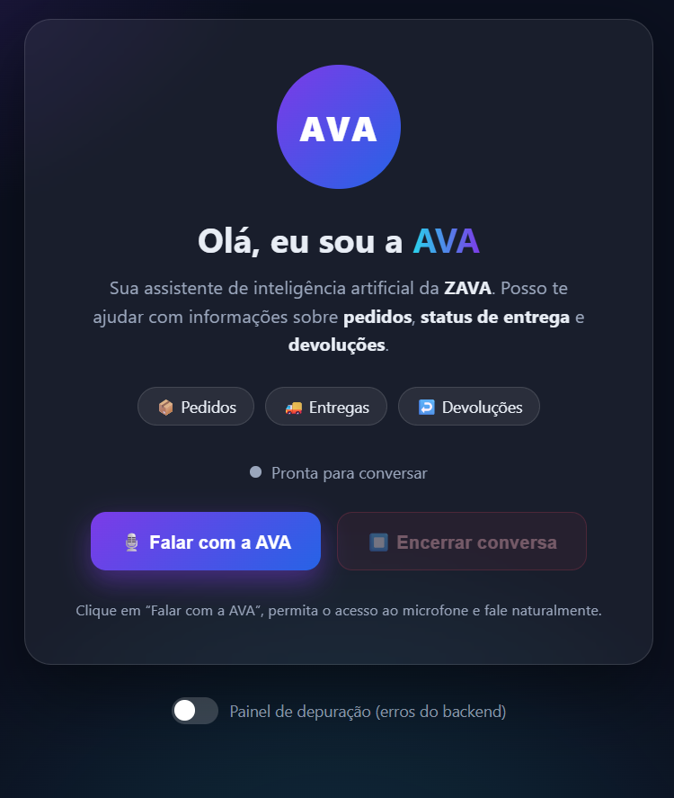

# Ava — Assistente Virtual da ZAVA

<p align="center">
  
</p>

A **Ava** é uma assistente de voz em português do Brasil criada para simular o atendimento de um call center da ZAVA. A aplicação usa o Azure Voice Live para manter uma conversa em tempo real, com entrada e saída de áudio.

Este projeto é uma personalização do repositório [Azure-Samples/call-center-voice-agent-accelerator](https://github.com/Azure-Samples/call-center-voice-agent-accelerator). Consulte o repositório original para detalhes de arquitetura, implementação, requisitos, implantação, telefonia, segurança e solução de problemas.

## O que a Ava faz

A Ava atende clientes com dúvidas relacionadas a:

- status de pedidos;
- prazo e condições de entrega;
- devoluções;
- oferta de crédito no cartão ao final do atendimento.

No início da conversa, ela se apresenta como assistente de Inteligência Artificial da ZAVA. O atendimento deve ser breve, natural, cordial e objetivo.

### Comportamento atual

- A conversa acontece sempre em português do Brasil.
- A Ava pede dados como número do pedido, CPF ou e-mail quando necessário.
- O status de qualquer pedido é **simulado** e sempre informado como **“em andamento”**.
- A Ava não fornece código de rastreamento nem inventa dados.
- A oferta de crédito só é apresentada depois que a dúvida principal é atendida.
- A oferta deve ser breve e não deve ser repetida quando o cliente não demonstrar interesse.

> Esta versão demonstra o fluxo conversacional. As informações de pedido, entrega, devolução e crédito não estão integradas a sistemas reais.

## Instruções básicas de uso

Ao falar com a Ava:

1. Informe se deseja consultar um pedido, uma entrega ou uma devolução.
2. Forneça apenas os dados solicitados durante a simulação.
3. Faça uma pergunta por vez e aguarde a resposta.
4. Ao final, confirme se a dúvida foi resolvida.

Exemplos:

- “Quero saber o status do meu pedido.”
- “Qual é o prazo de entrega?”
- “Como faço para devolver um produto?”
- “Quero entender a oferta de crédito.”

## Configuração atual

| Item | Valor atual | Onde alterar |
|---|---|---|
| Instruções da Ava | Prompt em português com fluxo de pedidos, entrega, devolução e crédito | `server/app/handler/voicelive_media_handler.py`, método `_session_config()`, variável `instructions` |
| Modelo Voice Live | `gpt-realtime` — Voice Live Pro | `VOICE_LIVE_MODEL` em `server/.env` para execução local |
| Modelo usado no Azure | Recebido pela variável `AZURE_VOICE_LIVE_MODEL` e publicado como `VOICE_LIVE_MODEL` | `infra/main.parameters.json` e `infra/modules/containerapp.bicep` |
| Voz TTS | `pt-BR-ThalitaMultilingualNeural` | `server/app/handler/voicelive_media_handler.py`, propriedade `voice` |
| Velocidade da voz | `+10%` | Parâmetro `rate` da propriedade `voice` |
| Variação da voz | `0.8` | Parâmetro `temperature` da propriedade `voice` |
| Detecção de fala | `AzureSemanticVad` | Método `_session_config()` |
| Redução de ruído | `azure_deep_noise_suppression` | Método `_session_config()` |
| Som ambiente | Desativado (`none`) | `AMBIENT_PRESET` em `server/.env` |

## Como alterar as instruções da Ava

O prompt principal está na variável `instructions`, dentro do método `_session_config()`:

```text
server/app/handler/voicelive_media_handler.py
└── VoiceLiveMediaHandler._session_config()
    └── instructions
```

Esse é o local para alterar:

- nome e identidade da assistente;
- empresa representada;
- saudação inicial;
- assuntos atendidos;
- regras de negócio;
- informações que podem ou não ser fornecidas;
- tom de voz;
- etapas do atendimento;
- mensagem de encerramento;
- critérios para oferta de produtos.

### Estrutura de prompt sugerida

Um bom prompt para a Ava deve separar claramente:

1. **Identidade:** quem é a Ava e qual empresa representa.
2. **Idioma:** português do Brasil.
3. **Objetivo:** o que deve resolver durante a chamada.
4. **Escopo:** assuntos permitidos e assuntos que devem ser encaminhados.
5. **Tom:** cordial, natural, breve e profissional.
6. **Fluxo:** saudação, identificação da necessidade, coleta de dados, resposta, confirmação e encerramento.
7. **Regras:** fatos que nunca podem ser inventados.
8. **Segurança:** dados sensíveis que não devem ser solicitados ou repetidos.
9. **Fallback:** o que fazer quando não souber responder.
10. **Encerramento:** confirmar a resolução antes de oferecer outro produto.

Exemplo resumido:

```text
Você é Ava, assistente virtual da ZAVA, e fala sempre em português do Brasil.

Objetivo:
- Atender dúvidas sobre pedidos, entregas e devoluções.
- Responder de forma breve, clara e cordial.

Regras:
- Nunca invente dados de clientes, pedidos ou rastreamento.
- Quando uma informação não estiver disponível, explique a limitação.
- Peça somente os dados necessários para continuar.
- Confirme se a dúvida foi resolvida antes de encerrar.
- Encaminhe para atendimento humano quando o assunto estiver fora do escopo.

Estilo:
- Use frases curtas e naturais, adequadas para uma conversa por voz.
- Faça apenas uma pergunta por vez.
- Não repita a mesma informação sem necessidade.
```

Para uma integração real, substitua as regras simuladas por resultados recebidos dos sistemas da empresa. O modelo não deve ser orientado a inventar dados ausentes.

## Como alterar a voz

A voz da Ava é configurada no retorno de `RequestSession`, no método `_session_config()`:

```python
voice=AzureStandardVoice(
    name="pt-BR-ThalitaMultilingualNeural",
    temperature=0.8,
    rate="+10%",
)
```

Para trocar a voz, altere:

- `name`: nome da voz compatível com o Azure Speech;
- `temperature`: nível de variação expressiva;
- `rate`: velocidade, por exemplo `"+10%"`, `"0%"` ou `"-10%"`.

O código também contém `pt-BR-GiovannaNeural` como alternativa comentada. Ative somente uma configuração de `voice` por vez.

### Voice Live Pro não é o mesmo que Azure Standard Voice

São configurações independentes:

- **Voice Live Pro, Basic ou Lite** define a categoria do modelo usado para interpretar e gerar a conversa.
- **`AzureStandardVoice`** define a voz de síntese que fala a resposta.

Assim, é possível usar um modelo Voice Live Pro e continuar usando uma `AzureStandardVoice`.

## Como alterar o modelo Voice Live

O modelo atual é `gpt-realtime`, da categoria **Voice Live Pro**. Esse modelo usa entrada e saída de áudio nativas e mantém a voz sintetizada configurada pela aplicação.

Modelos previstos pela configuração deste projeto:

| Categoria | Modelos |
|---|---|
| Voice Live Pro | `gpt-realtime`, `gpt-4o`, `gpt-4.1`, `gpt-5`, `gpt-5-chat` |
| Voice Live Basic | `gpt-realtime-mini`, `gpt-4o-mini`, `gpt-4.1-mini`, `gpt-5-mini` |
| Voice Live Lite | `gpt-5-nano`, `phi4-mm-realtime`, `phi4-mini` |

Antes de trocar o modelo, confirme disponibilidade regional, compatibilidade e preço na documentação oficial do Azure Voice Live.

Pontos de configuração:

- **Execução local:** variável `VOICE_LIVE_MODEL` em `server/.env`.
- **Configuração do ambiente Azure:** variável `AZURE_VOICE_LIVE_MODEL`.
- **Container App:** variável de ambiente `VOICE_LIVE_MODEL`.
- **Valor padrão da infraestrutura:** `infra/main.parameters.json`.
- **Repasse para o Container App:** `infra/modules/containerapp.bicep`.

Alterar o modelo no arquivo local não modifica automaticamente uma revisão já publicada no Azure Container Apps.

## XML, SSML e TwiML

Não existe um arquivo XML de configuração da voz da Ava nesta versão.

A sessão do Azure Voice Live é configurada diretamente em Python por meio de `RequestSession` e `AzureStandardVoice`. Portanto, a voz principal, a velocidade e as instruções devem ser alteradas em `server/app/handler/voicelive_media_handler.py`, e não em XML ou SSML.

Quando a telefonia Twilio é utilizada, o TwiML é gerado dinamicamente em:

```text
server/app/providers/twilio/event_handler.py
└── TwilioEventHandler.generate_stream_twiml()
```

A chamada `resp.say(...)` controla somente a mensagem temporária reproduzida pelo Twilio antes da conexão com a Ava. Ela não altera a voz usada pelo Azure Voice Live durante a conversa.

## Recomendações para evolução do prompt

- Defina quando a Ava deve transferir o atendimento para uma pessoa.
- Adicione mensagens específicas para indisponibilidade de sistemas.
- Informe quais dados pessoais podem ser solicitados e como confirmá-los com segurança.
- Evite colocar segredos, credenciais ou dados reais de clientes no prompt.
- Prefira respostas curtas, pois textos longos prejudicam a experiência por telefone.
- Inclua regras para interrupções, silêncio e pedidos de repetição.
- Crie exemplos de situações válidas e inválidas.
- Separe fatos fixos da empresa de dados obtidos em tempo real.
- Teste sotaques, ruído, fala rápida e interrupções antes de alterar a voz em produção.
- Revise periodicamente as ofertas comerciais e as exigências de consentimento.

## Referência de implementação

Para qualquer detalhe técnico que não seja específico da Ava, consulte o projeto original:

**[Azure-Samples/call-center-voice-agent-accelerator](https://github.com/Azure-Samples/call-center-voice-agent-accelerator)**
